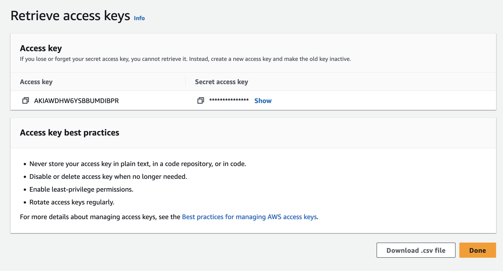
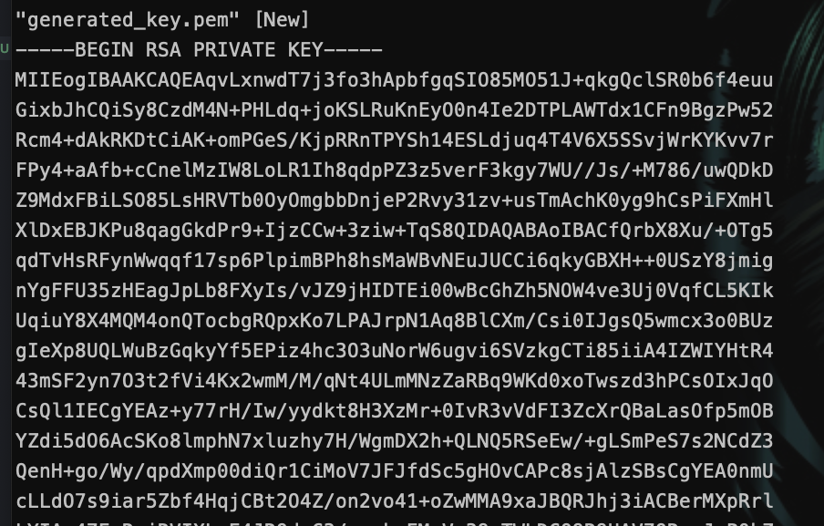
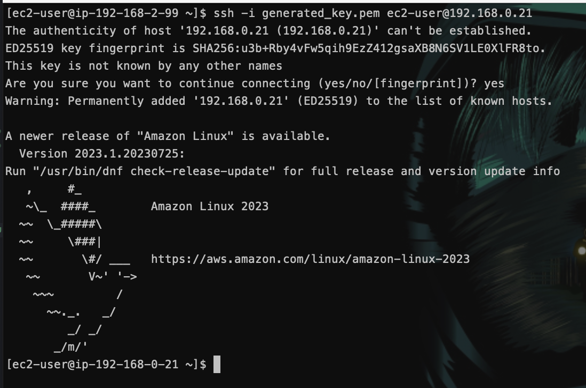

# aws-terraform-devops-upskilling-3pg
- AWS in 3 tiers deployed using Terraform.

# Configuración
- Configuration variables
  
```
export AWS_ACCESS_KEY_ID="TU_ACCESS_KEY"
export AWS_SECRET_ACCESS_KEY="TU_SECRET_KEY"
```

# How to create the infrastructure.
```
terraform init
terraform plan 
terraform apply
```

# How to destroy the infrastructure.
```
terraform destroy
```

# Expected Infrastructure


# How to connect to an EC2 instance
```
chmod 400 generated_key.pem
ssh -i generated_key.pem ec2-user@<EC2_INSTANCE_PUBLIC_IP>
```


# Lab walkthrough from scratch
1. Create a new IAM User, It might be called: terraform


2. Create a new policy wwith the following permission, it might be called: terraform-policy
```
{
    "Version": "2012-10-17",
    "Statement": [
        {
            "Effect": "Allow",
            "Action": [
                "ec2:*",
                "s3:*",
                "elasticloadbalancing:*",
                "logs:*",
                "rds:*"
            ],
            "Resource": "*"
        }
    ]
}
```


3. Associate new policy to new IAM User


4. Let's go ahead to create a new security credentails in the tab with the same name and click in ``Create access key`` and choise ``Other`` Use Case; you can set ``terraform-aws-credentials`` as description tag value and click on ``Create access key``


5. Retrive your Access Key and Secret Access Key (click on ``Show``) **Don't expose those values to the public**


6. Set the terraform AWS environment variables in your terminal
```
export AWS_ACCESS_KEY_ID="TU_ACCESS_KEY"
export AWS_SECRET_ACCESS_KEY="TU_SECRET_KEY"
```


7. Let's perform ``terraform init`` command, It is going to download all providers from terraform.


8. Let's perform a ``terraform plan`` command, It is going to make a blue print about all resources will create!, it's too long and looks like:


9.  Let's perform a ``terraform apply`` command, you will need to type ``yes`` in order to confirm, terraform will create all resources for you,
    it will take around 5 minutes.


10. There 3 important outputs values to us  
(urls for illustrative purposes.)
```
load_balancer_external_dns = "frontend-1750025673.us-east-1.elb.amazonaws.com"
load_balancer_internal_dns = "backend-1402541932.us-east-1.elb.amazonaws.com"
db_instance_endpoint = "myrdsinstance.cc6ucpiixjk9.us-east-1.rds.amazonaws.com:3306"
```

11. How to test public layer? you can hit the api from your local machine cause is public.


12. How to test private layer? 
- Set permission to key pair generated by terraform in your project side
```
chmod 400 generated_key.pem
```
- Connect to a public ec2 (either of the two public 1 or public 2), get the ``public ip`` and perform the next command
```
ssh -i generated_key.pem ec2-user@<EC2_INSTANCE_PUBLIC_IP>
```

(ip for illustrative purposes.)
ssh -i generated_key.pem ec2-user@54.87.14.189


- Hit the private dns inside public ec2 machine
(urls for illustrative purposes.)
```
curl backend-1402541932.us-east-1.elb.amazonaws.com
```


13. How to test database connection?
- Let's connect inside private ec2 (either of the two private 1 or private 2)
- first of all we need to copy our private key inside it 
- Create a new file called: generated_key.pem
- Paste the content of ``generated_key.pem``

- Set permission on new key pair created in the last step.
```
chmod 400 generated_key.pem
```
- get the ``private ip`` and perform the next command

- Connect to a private ec2 (either of the two public 1 or public 2), get the ``public ip`` and perform the next command
```
ssh -i generated_key.pem ec2-user@192.168.0.21
```


14. We already are inside private layer, so we can try to hit database. 
- Let's try firs of all by telnet
(url for illustrative purposes.)
```
telnet myrdsinstance.cc6ucpiixjk9.us-east-1.rds.amazonaws.com 3306
```


- Now, We will perform a Mysql Connection
```
mysql -u myrdsuser -p  -h myrdsinstance.cc6ucpiixjk9.us-east-1.rds.amazonaws.com -P 3306
password: myrdspassword   (only for test purposes)
```


# Definition of the layers

# Presentation layer
This is the topmost level of the application, responsible for gathering information. It provides a user interface and handles user interactions, sending content to browsers in the form of HTML/JS/CSS and communicates with other layers to provide results to the browser/client-side.

# Logic layer
Also known as the application layer. It contains a set of rules for processing information, business logic, and can accommodate many users. It is sometimes also referred to as middleware. It 

# Data layer
A database, comprising both datasets and the database management system or RDBMS software that manages and provides access to the data (back-end). It provides data security, integrity, and support to the application.

# Application 
https://github.com/JamesonC/CRUD-react-express-node-postgresql

# References
https://aws.plainenglish.io/3-tier-architecture-in-aws-e410d610ed74
https://github.com/AWS-Devops-Projects/Terraform-3tier-architecture-AWS
