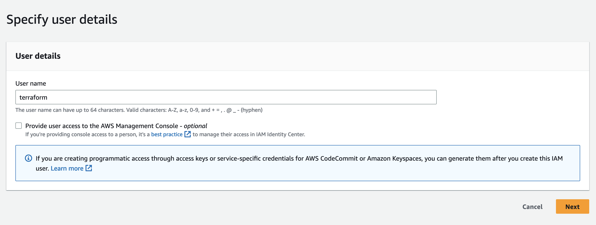
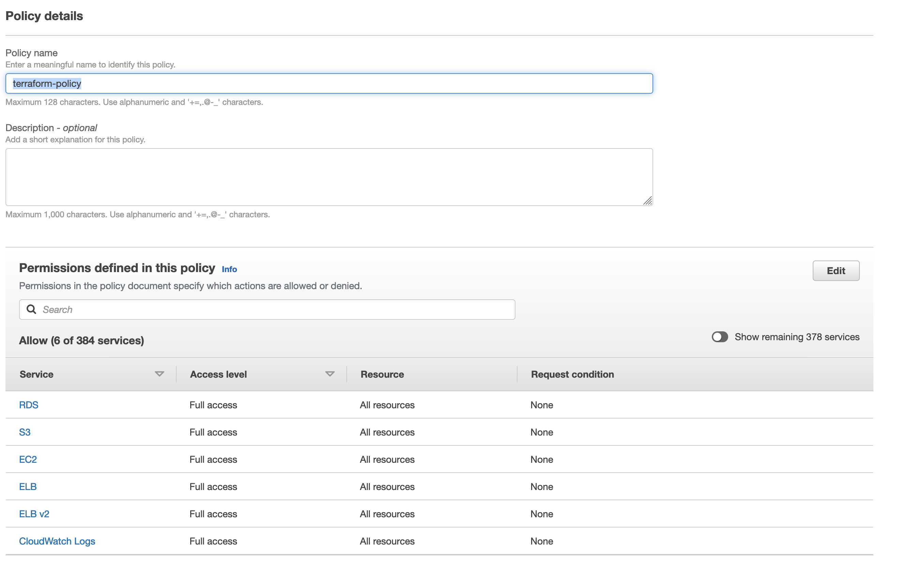
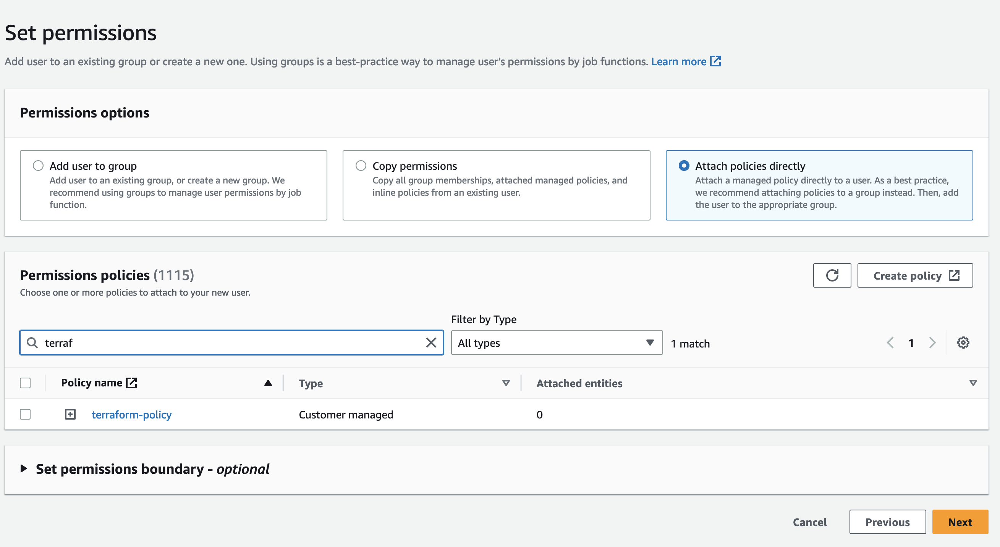
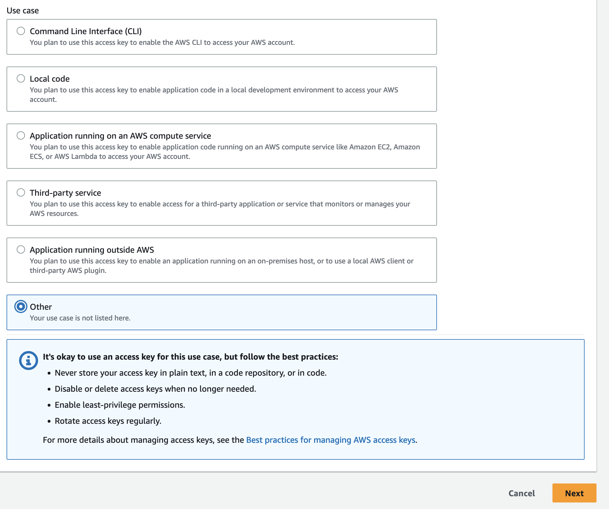
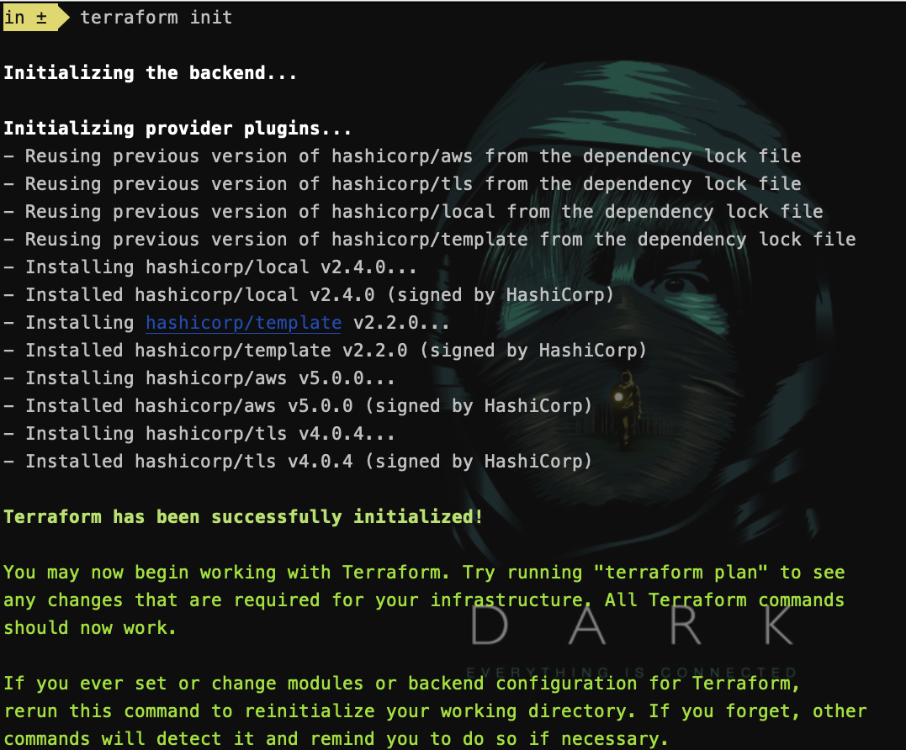
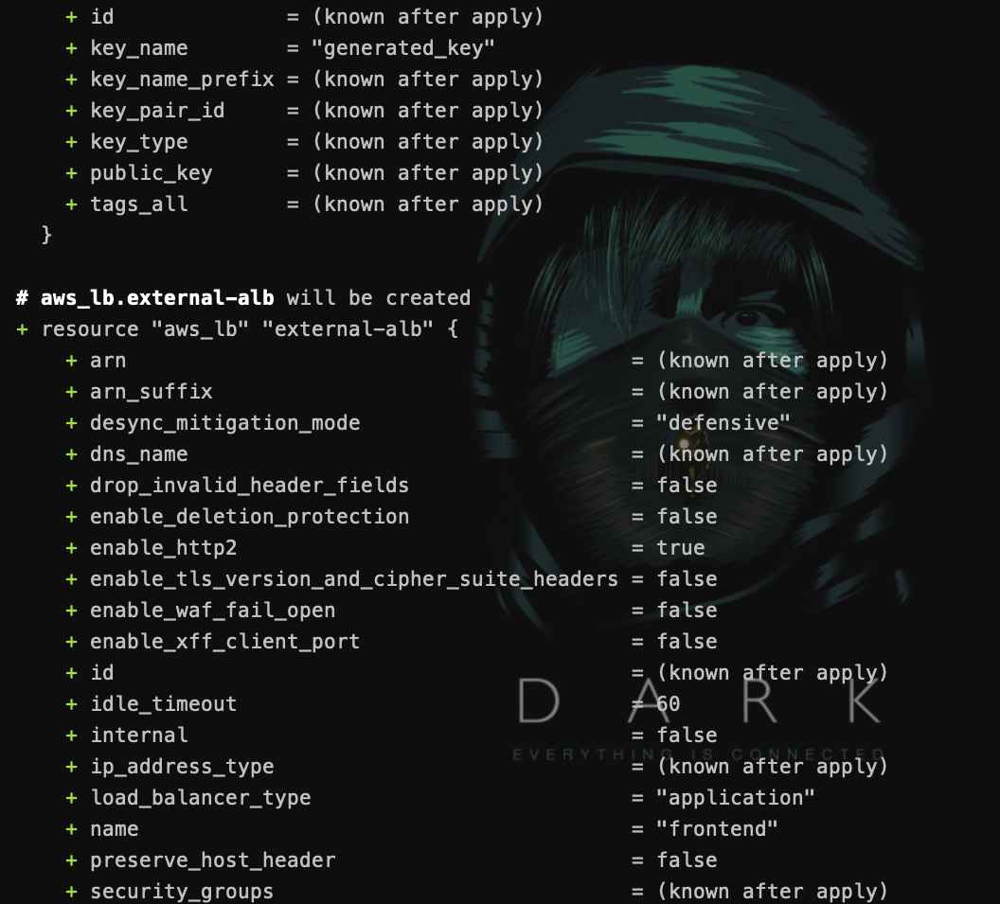

# DevOps Lab: AWS Terraform 3-Tier Architecture
- This repository contains the code to deploy a 3-tier architecture on AWS using Terraform. 
The architecture includes a Presentation layer, a Logic layer, and a Data layer. 
Follow the steps below to set up and use the infrastructure.
- Slides: https://view.genial.ly/64b8efc25ec0af0018526256

# Configuración
- Before proceeding, make sure you have the following environment variables set up with your AWS access credentials:
```
export AWS_ACCESS_KEY_ID="TU_ACCESS_KEY"
export AWS_SECRET_ACCESS_KEY="TU_SECRET_KEY"
```

# How to create the infrastructure.
1. Initialize Terraform:
```
terraform init
```
2. Generate a blueprint for the infrastructure:
```
terraform plan
```
3. Create the infrastructure (you will be prompted to confirm with "yes"):
```
terraform apply
```

# How to destroy the infrastructure.
To remove all resources created by Terraform, use the following command:
```
terraform destroy
```

# Expected Infrastructure
Here is an architectural diagram illustrating the expected infrastructure setup:


# How to connect to an EC2 instance
To connect to an EC2 instance, follow these steps:

1. Set appropriate permissions for the key pair generated by Terraform:
```
chmod 400 generated_key.pem
```
2. SSH into the EC2 instance using the generated key:
```
ssh -i generated_key.pem ec2-user@<EC2_INSTANCE_PUBLIC_IP>
```

# Lab walkthrough from scratch
Follow these steps to set up the lab environment from scratch:

1. Create a new IAM User with the name "terraform."


2. Create a new policy with the following permissions (you can name it "terraform-policy"):
```
{
    "Version": "2012-10-17",
    "Statement": [
        {
            "Effect": "Allow",
            "Action": [
                "ec2:*",
                "s3:*",
                "elasticloadbalancing:*",
                "logs:*",
                "rds:*"
            ],
            "Resource": "*"
        }
    ]
}
```


3. Associate the new policy with the "terraform" IAM User.


4. Create access keys for the "terraform" IAM User and store the Access Key and Secret Access Key securely.




5. Set the Terraform AWS environment variables in your terminal using the Access Key and Secret Access Key obtained in the previous step. **Don't expose those values to the public**


6. Set the terraform AWS environment variables in your terminal
```
export AWS_ACCESS_KEY_ID="TU_ACCESS_KEY"
export AWS_SECRET_ACCESS_KEY="TU_SECRET_KEY"
```


7. Initialize Terraform to download all required providers:


8. Preview the resources that will be created with Terraform:


9. Deploy the infrastructure with Terraform (you will need to confirm with "yes"):


10. Take note of the important output values provided by Terraform. These include URLs for accessing different layers of the architecture.
(urls for illustrative purposes.)
```
load_balancer_external_dns = "frontend-1750025673.us-east-1.elb.amazonaws.com"
load_balancer_internal_dns = "backend-1402541932.us-east-1.elb.amazonaws.com"
db_instance_endpoint = "myrdsinstance.cc6ucpiixjk9.us-east-1.rds.amazonaws.com:3306"
```

11. Test the public layer by making API requests from your local machine.


12. Test the private layer by connecting to a public EC2 instance and making requests to the private DNS.
- Set permission to key pair generated by terraform in your project side
```
chmod 400 generated_key.pem
```
- Connect to a public ec2 (either of the two public 1 or public 2), get the ``public ip`` and perform the next command
```
ssh -i generated_key.pem ec2-user@<EC2_INSTANCE_PUBLIC_IP>
```

(ip for illustrative purposes.)
ssh -i generated_key.pem ec2-user@54.87.14.189


- Hit the private dns inside public ec2 machine
(urls for illustrative purposes.)
```
curl backend-1402541932.us-east-1.elb.amazonaws.com
```


13. How to test database connection?
- Let's connect inside private ec2 (either of the two private 1 or private 2)
- first of all we need to copy our private key inside it 
- Create a new file called: generated_key.pem
- Paste the content of ``generated_key.pem``

- Set permission on new key pair created in the last step.
```
chmod 400 generated_key.pem
```
- get the ``private ip`` and perform the next command

- Connect to a private ec2 (either of the two public 1 or public 2), get the ``public ip`` and perform the next command
```
ssh -i generated_key.pem ec2-user@192.168.0.21
```


14. Test the database connection by connecting to a private EC2 instance and using MySQL to connect to the RDS instance.
- Let's try firs of all by telnet
(url for illustrative purposes.)
```
telnet myrdsinstance.cc6ucpiixjk9.us-east-1.rds.amazonaws.com 3306
```


- Now, We will perform a Mysql Connection
```
mysql -u myrdsuser -p  -h myrdsinstance.cc6ucpiixjk9.us-east-1.rds.amazonaws.com -P 3306
password: myrdspassword   (only for test purposes)
```


# Definition of the layers

# Presentation layer
This is the topmost level of the application, responsible for gathering information. It provides a user interface and handles user interactions, sending content to browsers in the form of HTML/JS/CSS and communicates with other layers to provide results to the browser/client-side.

# Logic layer
Also known as the application layer. It contains a set of rules for processing information, business logic, and can accommodate many users. It is sometimes also referred to as middleware. It 

# Data layer
A database, comprising both datasets and the database management system or RDBMS software that manages and provides access to the data (back-end). It provides data security, integrity, and support to the application.

# Application 
https://github.com/JamesonC/CRUD-react-express-node-postgresql

# References
https://aws.plainenglish.io/3-tier-architecture-in-aws-e410d610ed74
https://github.com/AWS-Devops-Projects/Terraform-3tier-architecture-AWS
